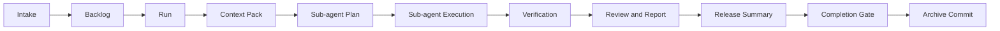
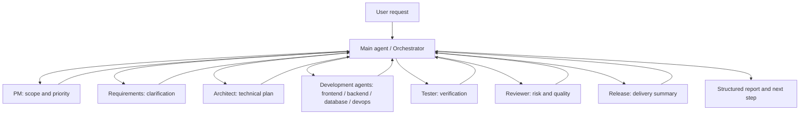

# CrewUp

Default language: [中文](./README.md) | English


CrewUp is a workflow framework for real engineering repositories. It turns intake, context, delegation, verification, reporting, and archive commits into one traceable loop.

It is framework-agnostic and does not require an `apps/`, `packages/`, or monorepo layout. Whether your project is web, backend, scripts, desktop, or mixed, CrewUp only provides the shared collaboration protocol; the real project structure is discovered and adapted by `crewup init` inside the target repository.

## Status Tags

| Tag | Meaning |
| --- | --- |
| `not-started` | No deliverable yet |
| `in-progress` | Partial output exists, but the loop is not closed |
| `blocked` | Human or external intervention is needed |
| `done-not-archived` | Work is done, but archive commit is pending |
| `closed` | Work is done and archived |

## The shortest path

```bash
npx crewup doctor
npx crewup install
npx crewup inspect --no-ai
npx crewup init --force
npx crewup check
npx crewup run "..."
npx crewup finish <run-id>
```

## Core Value

- **Project-agnostic**: CrewUp owns the generic workflow, not a specific business layout.
- **Clear roles**: the main agent coordinates PM, requirements, architecture, development, testing, review, and release roles.
- **Controlled context**: every run has input, status, tasks, artifacts, logs, and reports, so long conversations do not drift.
- **Explicit gates**: completion must pass checks, tests, review, and archive policy instead of relying on hand-waving.
- **Open-source friendly**: it can be installed as an npm package into any project, or shipped with the project-level `.harness/` workflow config.

## Install

```bash
npm install -D crewup
```

Start with a quick environment check:

```bash
npx crewup doctor
```

`crewup` is the npm package name and full CLI name. `.harness/` is the workflow core directory installed into the target project.

## First Use

For a real project, start with this sequence:

```bash
npx crewup doctor
npx crewup install
npx crewup inspect --no-ai
npx crewup init --force
npx crewup check
```

The flow is simple:

1. `doctor` checks the environment, repository, scripts, and prerequisites
2. `install` adds the shared workflow layer
3. `inspect` reads the real directory, language, and scripts
4. `init` generates the project adapter layer
5. `check` confirms the workflow can close the loop

After that, use the normal iteration flow:

```bash
npx crewup run "Implement now: ..."
npx crewup status
npx crewup report <run-id>
npx crewup finish <run-id>
```

## Quick Commands

| Step | Command | Purpose |
| --- | --- | --- |
| Diagnose environment | `npx crewup doctor` | Shows project, repository, scripts, and preconditions |
| Install workflow | `npx crewup install` | Writes `.harness/` and repository-level `AGENTS.md` |
| Inspect project | `npx crewup inspect --no-ai` | Scans the real directory, language, package manager, and scripts |
| Generate adapter | `npx crewup init --force` | Creates the project profile and rule entry under `.harness/project/` |
| Validate config | `npx crewup check` | Verifies the core configuration, scripts, and templates |
| Create iteration | `npx crewup run "..."` | Creates a run, selects a workflow profile, and generates an execution plan |
| Close the loop | `npx crewup finish <run-id>` | Runs completion gates and commits according to archive policy |

## Workflow Loop



Common commands:

```bash
npx crewup run "Implement now: ..."
npx crewup status
npx crewup next <run-id>
npx crewup report <run-id>
npx crewup gate-check <run-id>
npx crewup finish <run-id>
```

`run` creates or prepares a run based on task complexity and generates a sub-agent plan. `finish` attempts to move the run to `done` and triggers a git commit according to the archive policy after passing the gate. `finalize` is kept as a compatibility command; `finish` is the recommended daily entry.

## Skill Layers

CrewUp declares and routes skills, but it does not force every skill implementation into one directory. Recommended layout:

| Location | Purpose | Best for |
| --- | --- | --- |
| `.harness/config/skills.yaml` | Skill catalog and routing rules | Role-to-skill mapping, external candidates, install commands, activation notes |
| `.harness/skills/*.md` | CrewUp internal SOPs | Built-in workflow guidance such as build, test, ui-verify, and release-check |
| `.agents/skills/<skill-name>/SKILL.md` | Project-level skills | Skills that must be shared and reproduced with the repository |
| `%USERPROFILE%/.codex/skills/<skill-name>/SKILL.md` | User-global skills | Personal skills reused across projects |

Rule of thumb:

- Project-specific capabilities belong in `.agents/skills/`
- Personal cross-project capabilities belong in user-global `.codex/skills/`
- References and routing policy belong in `.harness/config/skills.yaml`
- `.cursor`, Claude, and similar directories are optional tool adapters, not the CrewUp source of truth

Context7, Playwright, Figma, Browser, MCP tools, and similar integrations are optional enhancements. If they are not installed, CrewUp should continue with project files, README content, lockfiles, official documentation links, or ordinary context analysis.

## Role Model



The main agent coordinates, collects results, handles blockers, and summarizes for the user. Development work goes to the relevant development agents; review, testing, and release notes are separate stages in the final report.

## Runtime Modes and Authentication

| Mode | Entry | Requires `OPENAI_API_KEY` | Notes |
| --- | --- | --- | --- |
| Native Codex sub-agents | `native-plan` followed by `spawn_agent` from the main agent | No extra setup | Uses the current Codex session and host tools. |
| Node SDK/API | `inspect --ai`, `orchestrate` without `--dry-run` | Yes | A terminal Node process calls the OpenAI SDK directly and cannot read the Codex Desktop login state. |
| Static / heuristic | `inspect --no-ai`, `check`, `report`, `doctor` | No | Reads local files and config only, without model calls. |

AI-assisted project inspection:

```bash
npx crewup inspect --ai
```

PowerShell:

```powershell
$env:OPENAI_API_KEY="your_api_key"
npx crewup inspect --ai
```

macOS/Linux:

```bash
OPENAI_API_KEY="your_api_key" npx crewup inspect --ai
```

## Closing the Loop

Automatic commits are controlled by `.harness/config/archive-policy.yaml`. By default, a commit only happens after a run reaches `done`, and only the current run, the source backlog file, and files recorded in the `changed-files` manifest are staged.

```bash
npx crewup archive-commit <run-id> --dry-run
npx crewup finish <run-id>
```

If a commit is blocked, register the change first:

```bash
npx crewup changed-files <run-id> add <file...>
npx crewup archive-commit <run-id>
```

If you want to see why a run cannot be archived yet:

```bash
npx crewup archive-status <run-id>
```

## Directory Structure

```text
.harness/
  agents/          # Role definitions
  backlog/         # Requirement queue
  config/          # Workflow, model, delegation, risk, and archive policies
  knowledge/       # Regenerable knowledge-layer index
  orchestrator/    # Main-agent routing rules
  project/         # Current-project adapter layer
  reports/         # Runtime reports
  runs/            # Per-iteration run data
  scripts/         # CLI and workflow scripts
  templates/       # Artifact templates
AGENTS.md          # Repository-level agent entry
```

In a target project, it is recommended to commit the workflow core under `.harness/`, plus `.harness/project/profile.yaml`, `.harness/project/overlay.yaml`, `AGENTS.md`, `README.md`, and `package.json`. CrewUp itself does not ship project-specific `.harness/project/*.yaml` files; they are generated inside the target project by `crewup init`.

It is usually not recommended to commit `.harness/runs/*`, `.harness/reports/*`, `.harness/dashboard/*`, `.harness/project/inspect.json`, `.harness/project/adapter-plan.json`, or temporary smoke-test backlog files.

## Report Output

`report <run-id>` generates a structured Markdown report with tables for agent name, type, execution status, result files, summary, changes, tests, blockers, and handoff notes. It works both as an iteration delivery record and as an index for future runs.

## Open Source Entry Points

| File | Purpose |
| --- | --- |
| [CONTRIBUTING.md](./CONTRIBUTING.md) | Contribution flow and commit guidance |
| [SECURITY.md](./SECURITY.md) | Security issue reporting |
| [CHANGELOG.md](./CHANGELOG.md) | Version change log |
| [examples/minimal-node/](./examples/minimal-node) | Minimal runnable example |

## Scope

CrewUp does not replace your build system, test framework, or business architecture. It provides an AI collaboration and delivery loop protocol. Real projects should keep their own README, test commands, CI/CD, release flow, and coding standards; CrewUp reads and references that information through `.harness/project/`.
