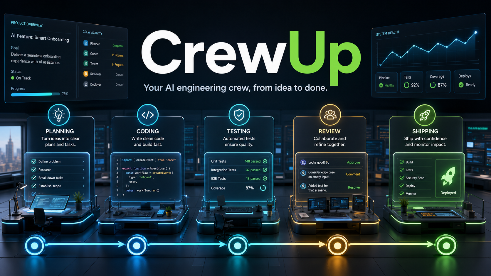
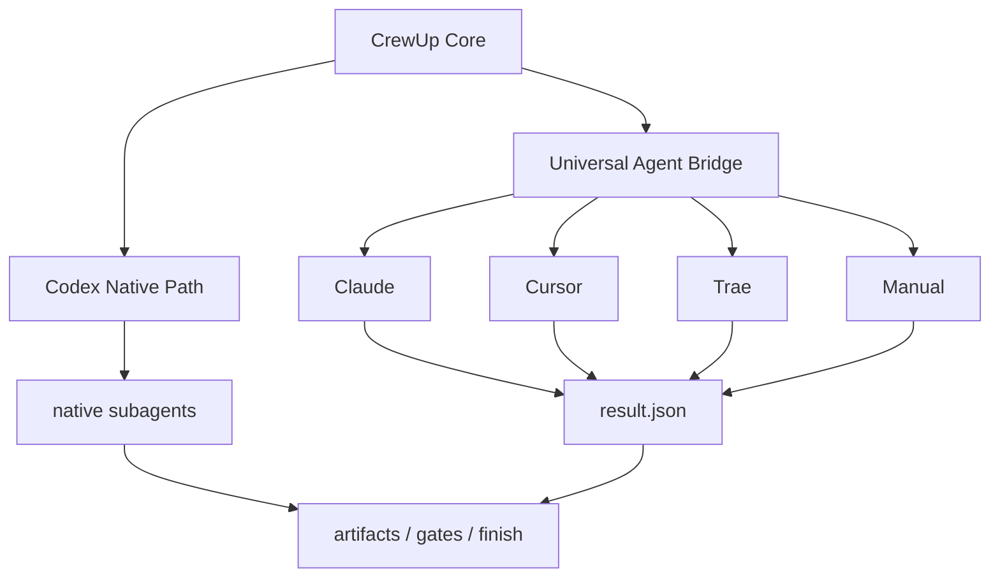
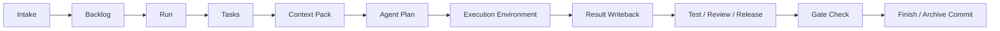

# CrewUp

Default language: [中文](./README.md) | English



CrewUp is an AI collaboration workflow framework for real engineering repositories. It turns intake, context, role delegation, execution results, verification, review, reporting, and archive commits into one traceable loop.

It is framework-agnostic and does not require an `apps/`, `packages/`, or monorepo layout. CrewUp owns the reusable workflow protocol; the target repository shape is discovered by `crewup inspect` and adapted by `crewup init`.

## Positioning

CrewUp uses a **Codex-native first, Universal Agent Bridge fallback, tool-adapter extension** architecture.



This means:

- The Codex path remains the stable primary path.
- Claude, Cursor, and Trae connect through the same bridge contract.
- External tools do not need identical native multi-agent APIs.
- Every execution result returns to `.harness/runs/<run-id>/`, then flows through gates, reports, and finish.

## Install

```bash
npm install -D crewup-harness
```

Start with:

```bash
npx crewup doctor
```

First-time setup inside a project:

```bash
npx crewup install
npx crewup inspect --no-ai
npx crewup init --force
npx crewup check
```

Choose an execution environment during init:

```bash
npx crewup init --agent codex
npx crewup init --agent claude
npx crewup init --agent cursor
npx crewup init --agent trae
npx crewup init --agent manual
```

Without `--agent`, CrewUp opens an interactive picker. It supports arrow-key selection when the terminal allows raw mode, and falls back to numbered selection otherwise. In CI or scripts, use `--yes` / `--no-interactive` to default to Codex.

## Daily Workflow

```bash
npx crewup run "Implement now: ..."
npx crewup status
npx crewup next <run-id>
npx crewup report <run-id>
npx crewup gate-check <run-id>
npx crewup finish <run-id>
```



## Codex Users

Codex is CrewUp's most complete execution path today.

```bash
npx crewup init --agent codex
npx crewup run "Implement login"
```

In Codex, the main agent reads generated tasks, context packs, and the native plan. It can then use Codex-native subagents to execute, wait, collect results, verify, review, report, and archive.

Codex/native model hints live in:

```text
.harness/config/model-policy.yaml
```

The `gpt-*` and `codex_model_hint` entries are native/Codex policy hints. They are not Claude, Cursor, or Trae model settings.

## Claude / Cursor / Trae Users

Claude, Cursor, and Trae use the Universal Agent Bridge. The bridge does not pretend that every tool has the same native multi-agent API. It provides a stable handoff and result-writeback contract.

Typical flow:

```bash
npx crewup init --agent claude
npx crewup run "Implement login"
npx crewup agent-plan <run-id>
```

CrewUp writes:

```text
.harness/runs/<run-id>/logs/agent-bridge/
  bridge-manifest.md
  bridge-manifest.json
  bridge-state.json
  <agent>.handoff.md
  <agent>.result.json
```

Open the relevant `<agent>.handoff.md` in Claude, Cursor, Trae, or another tool. After execution, write the final result to `<agent>.result.json`.

Result shape:

```json
{
  "agent": "frontend",
  "status": "completed",
  "summary": "Implemented the login form and state handling.",
  "artifactUpdates": [],
  "fileChanges": [],
  "recommendedCodeChanges": [],
  "tests": ["npm test"],
  "blockers": [],
  "handoff": "Continue with tester and reviewer."
}
```

Then continue:

```bash
npx crewup orchestrate <run-id>
npx crewup gate-check <run-id>
npx crewup report <run-id>
npx crewup finish <run-id>
```

## Runtime Modes

| Mode | Best for | Automation | Result source |
| --- | --- | --- | --- |
| `native` | Codex | Highest | Codex native subagent result |
| `bridge` | Claude / Cursor / Trae | Medium | External tool writes `result.json` |
| `manual` | Human or shell workflow | Low but reliable | Human writes `result.json` |

## Directory Structure

```text
.harness/
  agents/          # Role definitions
  backlog/         # Requirement queue
  config/          # Workflow, model, gates, risk, and archive policies
  knowledge/       # Regenerable knowledge indexes
  orchestrator/    # Main-agent routing rules
  project/         # Current-project adapter layer generated by crewup init
  reports/         # Runtime reports
  runs/            # Per-iteration run data
  scripts/         # CLI and workflow scripts
  templates/       # Artifact templates
AGENTS.md          # Repository-level agent entry
```

Recommended to commit:

- `.harness/` workflow core
- `.harness/project/profile.yaml`
- `.harness/project/overlay.yaml`
- `.harness/project/agent.yaml`
- `AGENTS.md`
- `README.md`
- `package.json`

Usually do not commit:

- `.harness/runs/*`
- `.harness/reports/*`
- `.harness/dashboard/*`
- `.harness/project/inspect.json`
- `.harness/project/adapter-plan.json`

## Common Commands

| Command | Purpose |
| --- | --- |
| `npx crewup doctor` | Check project, environment, and prerequisites |
| `npx crewup install` | Install `.harness/` and `AGENTS.md` |
| `npx crewup inspect --no-ai` | Static project inspection |
| `npx crewup init --force` | Generate project adapter files |
| `npx crewup check` | Validate config and core files |
| `npx crewup run "..."` | Create or prepare a requirement run |
| `npx crewup agent-plan <run-id>` | Generate a Codex native plan or bridge handoff |
| `npx crewup orchestrate <run-id>` | Collect SDK/native/bridge results |
| `npx crewup gate-check <run-id>` | Run completion gates |
| `npx crewup report <run-id>` | Generate a structured report |
| `npx crewup repair-artifacts <run-id>` | Normalize required test, review, and release artifact sections |
| `npx crewup finish <run-id>` | Finish and archive by policy |

## Skills and Plugins

CrewUp declares and routes skills; it does not force every skill implementation into `.harness/`.

| Location | Purpose |
| --- | --- |
| `.harness/config/skills.yaml` | Skill routing, candidates, and install notes |
| `.harness/skills/*.md` | CrewUp internal SOPs |
| `.agents/skills/<skill-name>/SKILL.md` | Project-level reproducible skills |
| `%USERPROFILE%/.codex/skills/<skill-name>/SKILL.md` | User-global skills |

Context7, Playwright, Figma, Browser, MCP tools, and similar integrations are optional enhancements. If unavailable, CrewUp should continue with project files, README content, lockfiles, official docs links, or ordinary context analysis.

## Authentication

| Scenario | API key required |
| --- | --- |
| `inspect --no-ai`, `check`, `doctor`, `report` | No |
| Codex Desktop native subagents | Uses current Codex session; no extra key |
| `inspect --ai` | Requires an available model runtime or API key |
| Node SDK/API orchestration | Requires `OPENAI_API_KEY` |
| Claude / Cursor / Trae bridge | CrewUp does not call a model; the external tool uses its own login/config |

## More Docs

| Document | Topic |
| --- | --- |
| [Universal Agent Bridge](./docs/universal-agent-bridge.en.md) | Handoff and result-writeback contract |
| [Agent Selection](./docs/harness-agent-selection.en.md) | Agent picker and adapter plan |
| [Agent Capabilities](./docs/harness-agent-capabilities.en.md) | Capability matrix and support levels |
| [Workflow](./docs/harness-workflow.en.md) | Command flow and run lifecycle |
| [Core Boundary](./docs/harness-core-boundary.en.md) | Reusable core vs project adaptation |
| [Extension Guide](./docs/harness-extension-guide.en.md) | Skills, policies, rules, and templates |
| [Hardening Roadmap](./docs/harness-hardening-roadmap.en.md) | Stability and open-source readiness plan |

## Scope

CrewUp does not replace your build system, test framework, CI/CD, or business architecture. It provides an AI collaboration and delivery-loop protocol. Real projects should keep their own README, test commands, release flow, and coding standards; CrewUp reads and references that information through `.harness/project/`.
