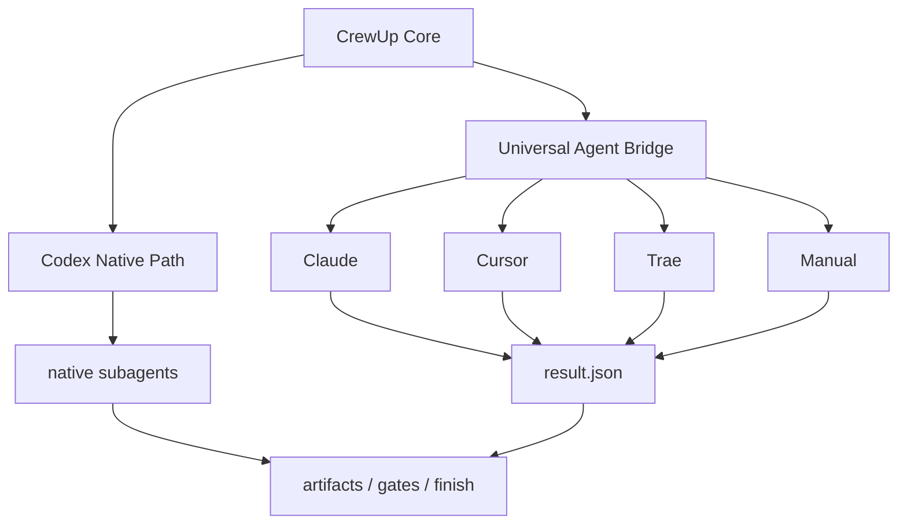
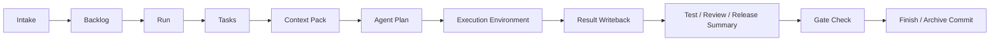

# CrewUp

[中文](./README.md) | English


CrewUp is a reusable AI collaboration workflow protocol for real engineering repositories. It turns intake, context preparation, role delegation, execution writeback, verification, review, release preparation, and archiving into one traceable loop.

CrewUp does not lock you into a specific stack or a fixed repository shape. It first reads evidence from the real target repo, then uses `crewup inspect` and `crewup init` to generate a project adapter layer that maps the shared workflow onto the repository you actually have.

## Where It Fits

- Teams or individuals who want a standardized AI development workflow
- Projects that need a consistent process across Codex, Claude, Cursor, Trae, or manual agent environments
- Real repositories that need requirements, planning, implementation, verification, review, and release to close in a repeatable loop

## Core Capabilities

- Codex-native path first, with a universal bridge for other tools
- Project adapter generation based on the actual repository
- Requirement freeze, context packing, token ledger, and quality gates
- Lightweight closure for docs-only tasks to avoid unnecessary test-agent overhead
- Bilingual documentation and a built-in flow smoke test

## How It Works



## Install

```bash
npm install -D crewup-harness
```

Run a preflight check:

```bash
npx crewup doctor
```

## First-Time Setup

```bash
npx crewup install
npx crewup inspect --no-ai
npx crewup init
npx crewup check
```

`crewup init` prepares the template in the target project, then generates the project adapter and knowledge baseline.

## Choose an Execution Environment

```bash
npx crewup init --agent codex
npx crewup init --agent claude
npx crewup init --agent cursor
npx crewup init --agent trae
npx crewup init --agent manual
```

Without `--agent`, CrewUp opens an interactive picker. It supports arrow-key selection when the terminal allows raw mode, and falls back to numbered selection otherwise. In CI or scripts, use `--yes` / `--no-interactive`.

## Daily Workflow

```bash
npx crewup run "Implement now: ..."
npx crewup status
npx crewup next <run-id>
npx crewup report <run-id>
npx crewup gate-check <run-id>
npx crewup finish <run-id>
npm run test:flow
```



## Key Directories

```text
.harness/
  AGENTS.md                # Main entry before formal project work
  orchestrator/            # Main agent, routing, and bridge contracts
  config/                  # Workflow, model, gate, delegation, and context policy
  project/                 # Current-project adapter layer generated by init
  runs/                    # Per-run input, tasks, artifacts, and logs
  reports/                 # Runtime summaries
  knowledge/               # Optional knowledge layer
```

## Typical Usage

Codex path:

```bash
npx crewup init --agent codex
npx crewup run "Implement login"
```

Claude / Cursor / Trae path:

```bash
npx crewup init --agent claude
npx crewup run "Implement login"
npx crewup agent-plan <run-id>
```

## Runtime Modes

| Mode | Best for | Description |
| --- | --- | --- |
| `native` | Codex | Uses Codex-native subagent capabilities when available |
| `bridge` | Claude / Cursor / Trae | Generates handoff and result-writeback contracts for external tools |
| `manual` | Human or script-based workflow | Keeps tasks, context, gates, and reports while the user or a script provides results |

Claude, Cursor, and Trae support focuses on one shared workflow protocol and stable result writeback. CrewUp does not assume that every tool exposes the same native multi-agent API.

## Common Commands

| Command | Purpose |
| --- | --- |
| `npx crewup doctor` | Check runtime environment and prerequisites |
| `npx crewup install` | Install the CrewUp template into a target project |
| `npx crewup inspect --no-ai` | Inspect project structure from the filesystem |
| `npx crewup inspect --ai` | Enhance project inspection when a model runtime is available |
| `npx crewup init` | Generate the project adapter layer |
| `npx crewup check` | Validate core config and required files |
| `npx crewup run "..."` | Create and prepare a requirement run |
| `npx crewup agent-plan <run-id>` | Generate a native plan or bridge handoff |
| `npx crewup status` | Show current run, budget, and context status |
| `npx crewup report <run-id>` | Generate a structured report |
| `npx crewup gate-check <run-id>` | Run closure gate checks |
| `npx crewup finish <run-id>` | Finish the run and archive by policy |

## More Docs

| Document | Topic |
| --- | --- |
| [Workflow](./docs/harness-workflow.en.md) | Command flow and run lifecycle |
| [Universal Agent Bridge](./docs/universal-agent-bridge.en.md) | External-agent handoff and result writeback |
| [Agent Selection](./docs/harness-agent-selection.en.md) | Agent selection and adapter generation |
| [Agent Capabilities](./docs/harness-agent-capabilities.en.md) | Support levels, capability boundaries, and claims |
| [Core Boundary](./docs/harness-core-boundary.en.md) | Reusable core vs project adapter layer |
| [Extension Guide](./docs/harness-extension-guide.en.md) | Skills, policies, rules, and templates |

## Notes

- `spec-freeze` compresses requirements into a short summary to reduce repeated long-context reads.
- `context-pack` collects only the files needed for the task and keeps token use low.
- `native-plan` generates either a native sub-agent plan or a bridge handoff.
- Docs-only tasks stay on a lighter closure path instead of always pulling the full test chain.
- `status` and `report` expose context budget and token ledger data.
- `npm run test:flow` runs a temporary-project smoke test covering install, init, docs-only run, and generated artifacts.

## Scope

CrewUp does not replace your build system, test framework, CI/CD, business architecture, or team conventions. It provides an AI collaboration and delivery-loop protocol. Real projects should keep their own README, test commands, release flow, and coding standards; CrewUp reads and references that information during initialization and runs.
