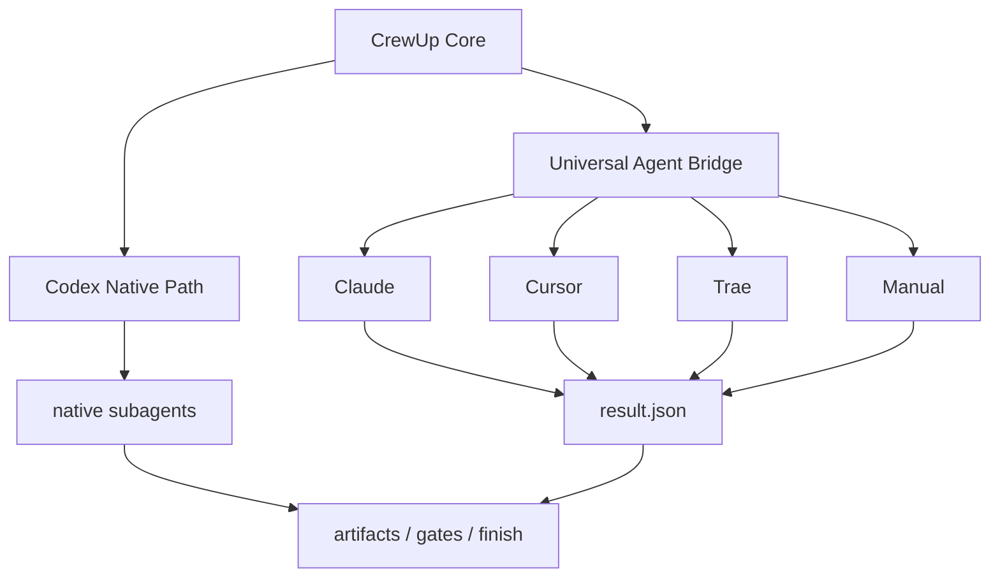

# CrewUp

默认语言：中文 | [English](./README.en.md)


CrewUp 是一套面向真实工程仓库的 AI 协作工作流框架。它把需求进入、上下文整理、角色分工、执行结果、验证、评审、报告和归档提交串成一条可追踪的闭环。

它不绑定具体技术栈，也不要求 `apps/`、`packages/` 或 monorepo 结构。CrewUp 只维护通用工作流协议；真实项目结构由 `crewup inspect` 和 `crewup init` 在目标仓库内识别并生成适配层。

## 核心定位

CrewUp 采用 **Codex 原生优先 + Universal Agent Bridge 兜底 + 工具适配器扩展** 的架构。



这意味着：

- Codex 路径保持主通路，不被实验性适配器污染。
- Claude、Cursor、Trae 通过统一 bridge 协议接入。
- 外部工具不需要拥有完全相同的原生多 agent API。
- 所有执行结果最终都回到 `.harness/runs/<run-id>/`，再进入 gate、report 和 finish。

## 安装

```bash
npm install -D crewup-harness
```

安装后先检查环境：

```bash
npx crewup doctor
```

如果是首次把 CrewUp 放进一个项目：

```bash
npx crewup install
npx crewup inspect --no-ai
npx crewup init --force
npx crewup check
```

`crewup init` 会让你选择执行环境：

```bash
npx crewup init --agent codex
npx crewup init --agent claude
npx crewup init --agent cursor
npx crewup init --agent trae
npx crewup init --agent manual
```

不传 `--agent` 时会进入交互式选择。支持上下键回车选择；如果当前终端不支持 raw mode，会自动退到编号选择。CI 或脚本中可以使用 `--yes` / `--no-interactive` 默认选择 Codex。

## 日常工作流

```bash
npx crewup run "现在实现：..."
npx crewup status
npx crewup next <run-id>
npx crewup report <run-id>
npx crewup gate-check <run-id>
npx crewup finish <run-id>
```

完整闭环：


## Codex 用户

Codex 是 CrewUp 当前最完整的执行路径。

```bash
npx crewup init --agent codex
npx crewup run "现在实现：登录功能"
```

在 Codex 环境里，主 agent 会读取生成的任务、上下文和 native plan，然后使用 Codex 原生子 agent 能力执行、等待、收集结果，并继续进入验证、评审、报告和归档。

Codex 原生路径的模型策略来自：

```text
.harness/config/model-policy.yaml
```

这里的 `gpt-*` / `codex_model_hint` 只代表 Codex/native 路径的模型建议，不代表 Claude、Cursor 或 Trae 的模型配置。

## Claude / Cursor / Trae 用户

Claude、Cursor、Trae 当前走 Universal Agent Bridge。它不是虚假宣称“所有工具都有原生多子 agent”，而是提供稳定的任务交接和结果回写协议。

典型流程：

```bash
npx crewup init --agent claude
npx crewup run "现在实现：登录功能"
npx crewup agent-plan <run-id>
```

CrewUp 会生成：

```text
.harness/runs/<run-id>/logs/agent-bridge/
  bridge-manifest.md
  bridge-manifest.json
  bridge-state.json
  <agent>.handoff.md
  <agent>.result.json
```

然后你在 Claude / Cursor / Trae 中打开对应的 `<agent>.handoff.md`，让工具执行任务。执行完成后，把结果写回对应的 `<agent>.result.json`。

结果格式：

```json
{
  "agent": "frontend",
  "status": "completed",
  "summary": "完成了前端登录表单和状态处理。",
  "artifactUpdates": [],
  "fileChanges": [],
  "recommendedCodeChanges": [],
  "tests": ["npm test"],
  "blockers": [],
  "handoff": "请进入 tester 和 reviewer 阶段。"
}
```

结果写回后继续：

```bash
npx crewup orchestrate <run-id>
npx crewup gate-check <run-id>
npx crewup report <run-id>
npx crewup finish <run-id>
```

## 执行模式

| 模式 | 适用对象 | 自动化程度 | 结果来源 |
| --- | --- | --- | --- |
| `native` | Codex | 最高 | Codex 原生子 agent |
| `bridge` | Claude / Cursor / Trae | 中等 | 外部工具写回 `result.json` |
| `manual` | 人工 / shell 流程 | 低但可靠 | 人工写回 `result.json` |

## 关键目录

```text
.harness/
  agents/          # 角色说明
  backlog/         # 需求队列
  config/          # 工作流、模型、门禁、风险、归档策略
  knowledge/       # 可再生成的知识层索引
  orchestrator/    # 主 agent 调度规则
  project/         # 当前项目适配层，由 crewup init 生成
  reports/         # 运行期报告
  runs/            # 每次需求迭代的运行数据
  scripts/         # CLI 与工作流脚本
  templates/       # artifacts 模板
AGENTS.md          # 仓库级 agent 入口
```

推荐提交：

- `.harness/` 工作流核心
- `.harness/project/profile.yaml`
- `.harness/project/overlay.yaml`
- `.harness/project/agent.yaml`
- `AGENTS.md`
- `README.md`
- `package.json`

通常不建议提交：

- `.harness/runs/*`
- `.harness/reports/*`
- `.harness/dashboard/*`
- `.harness/project/inspect.json`
- `.harness/project/adapter-plan.json`

## 常用命令

| 命令 | 作用 |
| --- | --- |
| `npx crewup doctor` | 检查项目、环境和前置条件 |
| `npx crewup install` | 安装 `.harness/` 和 `AGENTS.md` |
| `npx crewup inspect --no-ai` | 静态识别项目结构 |
| `npx crewup init --force` | 生成项目适配层 |
| `npx crewup check` | 校验配置和核心文件 |
| `npx crewup run "..."` | 创建或准备一次需求 run |
| `npx crewup agent-plan <run-id>` | 生成 Codex native plan 或 bridge handoff |
| `npx crewup orchestrate <run-id>` | 收集 SDK/native/bridge 结果 |
| `npx crewup gate-check <run-id>` | 执行完成门禁 |
| `npx crewup report <run-id>` | 生成结构化报告 |
| `npx crewup repair-artifacts <run-id>` | 补齐测试、评审、发布产物的必需标题和空状态 |
| `npx crewup finish <run-id>` | 推进完成并按归档策略提交 |

## Skill 与插件

CrewUp 只声明和调度 skill，不要求所有 skill 都内置在 `.harness/`。

| 位置 | 作用 |
| --- | --- |
| `.harness/config/skills.yaml` | skill 路由、候选项和安装说明 |
| `.harness/skills/*.md` | CrewUp 内部 SOP |
| `.agents/skills/<skill-name>/SKILL.md` | 项目级可复现 skill |
| `%USERPROFILE%/.codex/skills/<skill-name>/SKILL.md` | 用户全局 skill |

Context7、Playwright、Figma、Browser、MCP 等能力都是可选增强。没有安装时，CrewUp 应继续基于项目文件、README、锁文件、官方文档链接或普通上下文分析降级运行。

## 认证说明

| 场景 | 是否需要 API Key |
| --- | --- |
| `inspect --no-ai`、`check`、`doctor`、`report` | 不需要 |
| Codex Desktop 原生子 agent | 使用当前 Codex 会话，不需要额外 API Key |
| `inspect --ai` | 需要可用模型环境或 API Key |
| Node SDK/API 编排 | 需要 `OPENAI_API_KEY` |
| Claude / Cursor / Trae bridge | CrewUp 不直接调用模型；外部工具按自己的方式登录或配置 |

## 更多文档

| 文档 | 内容 |
| --- | --- |
| [Universal Agent Bridge](./docs/universal-agent-bridge.md) | 任务交接和结果写回协议 |
| [Agent 选择](./docs/harness-agent-selection.md) | agent 选择器和适配层方案 |
| [Agent 能力矩阵](./docs/harness-agent-capabilities.md) | 支持等级、能力边界和声明规则 |
| [工作流](./docs/harness-workflow.md) | 命令流程和 run 生命周期 |
| [核心边界](./docs/harness-core-boundary.md) | 可复用核心与项目适配层边界 |
| [扩展指南](./docs/harness-extension-guide.md) | skills、policies、rules、templates 扩展方式 |
| [加固路线图](./docs/harness-hardening-roadmap.md) | 稳定性和开源可用性计划 |

## 边界

CrewUp 不替代构建系统、测试框架、CI/CD 或业务架构。它提供的是 AI 协作和交付闭环协议。真实项目仍应保留自己的 README、测试命令、发布流程和代码规范；CrewUp 会通过 `.harness/project/` 读取并引用这些信息。
