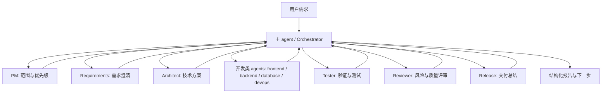

# CrewUp

默认语言：中文 | [English](./README.en.md)


CrewUp 是一套给真实工程仓库用的 AI 协作工作流框架。它把需求、上下文、分工、验证、报告和归档串成一条可追踪的闭环。

它不绑定具体技术栈，也不要求 `apps/`、`packages/` 或 monorepo 结构。无论是 Web、后端、脚本、桌面还是混合工程，CrewUp 都只负责通用协作协议；真实项目结构由 `crewup init` 在目标仓库里识别并生成适配层。

## 一眼看懂

| 标签 | 含义 |
| --- | --- |
| `not-started` | 还没产生有效交付 |
| `in-progress` | 已有阶段性产物，但未闭环 |
| `blocked` | 当前需要人工或外部条件介入 |
| `done-not-archived` | 已完成，但还没归档提交 |
| `closed` | 已完成并归档 |

## 你通常只需要这条路径

```bash
npx crewup doctor
npx crewup install
npx crewup inspect --no-ai
npx crewup init --force
npx crewup check
npx crewup run "..."
npx crewup finish <run-id>
```

## 核心价值

- **项目无关**：CrewUp 只维护通用工作流，不夹带某个业务项目的目录假设。
- **角色清晰**：主 agent 负责调度，PM、需求、架构、开发、测试、评审、发布等角色各司其职。
- **上下文可控**：每次 run 都有输入、状态、任务、产物、日志和报告，避免长对话失控。
- **门禁明确**：完成前必须经过检查、测试、评审和归档策略，不用靠口头承诺判断是否闭环。
- **开源友好**：可作为 npm 包安装到任意项目，也可以随项目提交 `.harness/` 工作流配置。

## 安装

```bash
npm install -D crewup-harness
```

安装后先做环境诊断：

```bash
npx crewup doctor
```

`crewup` 是 npm 包名和完整 CLI 名称；`.harness/` 是安装到目标项目内的工作流核心目录。

## 第一次使用

如果你要把它放进一个真实项目，建议按这个顺序走：

```bash
npx crewup doctor
npx crewup install
npx crewup inspect --no-ai
npx crewup init --force
npx crewup check
```

这套顺序的含义很简单：

1. `doctor` 检查环境、仓库、脚本和闭环前置条件
2. `install` 把通用工作流装进项目
3. `inspect` 读取真实目录、语言和脚本情况
4. `init` 生成项目适配层
5. `check` 确认配置和核心文件能闭环

完成后，再进入日常迭代：

```bash
npx crewup run "现在直接实现：..."
npx crewup status
npx crewup report <run-id>
npx crewup finish <run-id>
```

## 快速命令

| 步骤 | 命令 | 作用 |
| --- | --- | --- |
| 诊断环境 | `npx crewup doctor` | 查看项目、仓库、脚本和闭环前置条件 |
| 安装工作流 | `npx crewup install` | 写入 `.harness/` 和仓库级 `AGENTS.md` |
| 识别项目 | `npx crewup inspect --no-ai` | 扫描真实目录、语言、包管理器和可用脚本 |
| 生成适配层 | `npx crewup init --force` | 生成 `.harness/project/` 下的项目画像和规则入口 |
| 校验配置 | `npx crewup check` | 检查核心配置、脚本和模板是否完整 |
| 创建迭代 | `npx crewup run "..."` | 创建 run、选择工作流 profile、生成执行计划 |
| 完成收口 | `npx crewup finish <run-id>` | 运行完成门禁，并按归档策略提交 |

## 工作流闭环


日常迭代通常从 `run` 开始：

```bash
npx crewup run "现在直接实现：..."
npx crewup status
npx crewup next <run-id>
npx crewup report <run-id>
npx crewup gate-check <run-id>
npx crewup finish <run-id>
```

`run` 会根据需求复杂度创建或准备 run，并生成子 agent 计划。`finish` 会尝试推进到 `done`，通过门禁后按归档策略触发 git 提交。`finalize` 作为兼容命令保留，日常推荐使用 `finish`。

## Skill 分层

CrewUp 只负责声明和调度 skills，不把所有 skill 本体绑死在一个目录里。推荐分层如下：

| 位置 | 作用 | 适合放什么 |
| --- | --- | --- |
| `.harness/config/skills.yaml` | 技能目录和调度规则 | 角色对应哪些 skill、外部候选 skill、安装方式、是否启用 |
| `.harness/skills/*.md` | CrewUp 内部 SOP | build / test / ui-verify / release-check 这类内置流程说明 |
| `.agents/skills/<skill-name>/SKILL.md` | 项目级 skill | 这个项目必须共享、需要跟仓库一起复现的 skill |
| `%USERPROFILE%/.codex/skills/<skill-name>/SKILL.md` | 用户全局 skill | 你个人长期复用、跨项目都要用的 skill |

推荐原则：

- 项目专属能力放项目里
- 个人通用能力放用户全局
- 只做参考和编排的放 `.harness/config/skills.yaml`
- 不要把 `.cursor`、Claude、Codex 的目录当成唯一真源，CrewUp 只把它们看作可选执行环境

Context7、Playwright、Figma、Browser、MCP 等能力都是可选增强。没有安装这些插件时，CrewUp 仍应继续运行，并降级使用项目内文件、README、锁文件、官方文档链接或普通上下文分析。

## 角色协作模型



主 agent 负责调度、收集结果、处理阻塞和汇总给用户；开发类工作交给对应开发 agent；评审、测试和发布总结作为独立环节进入最终报告。

## 运行模式与认证

| 模式 | 入口 | 是否需要 `OPENAI_API_KEY` | 说明 |
| --- | --- | --- | --- |
| Codex 原生子 agent | `native-plan` 后由主 agent 调用 `spawn_agent` | 不需要额外配置 | 使用 Codex 当前登录会话和宿主工具。 |
| Node SDK/API | `inspect --ai`、`orchestrate` 非 `--dry-run` | 需要 | 终端 Node 进程直接调用 OpenAI SDK，无法读取 Codex Desktop 登录态。 |
| 静态/启发式 | `inspect --no-ai`、`check`、`report`、`doctor` | 不需要 | 只读本地文件和配置，不调用模型。 |

AI 辅助项目识别：

```bash
npx crewup inspect --ai
```

PowerShell：

```powershell
$env:OPENAI_API_KEY="your_api_key"
npx crewup inspect --ai
```

macOS/Linux：

```bash
OPENAI_API_KEY="your_api_key" npx crewup inspect --ai
```

## 完成收口

自动提交由 `.harness/config/archive-policy.yaml` 控制。默认只有 run 进入 `done` 后才会提交，并且只暂存当前 run、来源 backlog 文件和 `changed-files` manifest 中登记的文件。

```bash
npx crewup archive-commit <run-id> --dry-run
npx crewup finish <run-id>
```

如果提交被阻塞，先登记本次变更：

```bash
npx crewup changed-files <run-id> add <file...>
npx crewup archive-commit <run-id>
```

如果想先看清楚为什么不能归档提交：

```bash
npx crewup archive-status <run-id>
```

## 目录结构

```text
.harness/
  agents/          # 角色说明
  backlog/         # 需求队列
  config/          # 工作流、模型、委派、风险、归档策略
  knowledge/       # 可再生成的知识层索引
  orchestrator/    # 主 agent 调度规则
  project/         # 当前项目适配层，由 crewup init 生成
  reports/         # 运行期报告
  runs/            # 每次迭代的 run 数据
  scripts/         # CLI 和工作流脚本
  templates/       # artifacts 模板
AGENTS.md          # 仓库级 agent 入口
```

在目标项目中，建议提交 `.harness/` 的工作流核心、`.harness/project/profile.yaml`、`.harness/project/overlay.yaml`、`AGENTS.md`、`README.md` 和 `package.json`。CrewUp 模板包本身不内置具体项目的 `.harness/project/*.yaml`，这些文件由 `crewup init` 在目标项目内生成。

通常不建议提交 `.harness/runs/*`、`.harness/reports/*`、`.harness/dashboard/*`、`.harness/project/inspect.json`、`.harness/project/adapter-plan.json` 或临时 smoke test backlog。

## 报告输出

`report <run-id>` 会生成结构化 Markdown 报告，用表格展示 agent 名称、类型、执行状态、结果文件、摘要、变更、测试、阻塞点和 handoff。它适合直接作为一次 AI 迭代的交付记录，也可以被后续 run 作为上下文索引。

## 开源入口

| 文件 | 作用 |
| --- | --- |
| [CONTRIBUTING.md](./CONTRIBUTING.md) | 贡献方式与提交规范 |
| [SECURITY.md](./SECURITY.md) | 安全问题上报方式 |
| [CHANGELOG.md](./CHANGELOG.md) | 版本变更记录 |
| [examples/minimal-node/](./examples/minimal-node) | 最小可运行示例 |

## 边界

CrewUp 不替代构建系统、测试框架或业务架构。它提供的是 AI 协作和交付闭环协议。真实项目仍应保留自己的 README、测试命令、CI/CD、发布流程和代码规范；CrewUp 会通过 `.harness/project/` 读取并引用这些信息。
