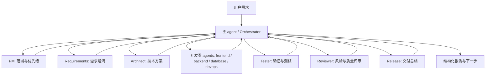

# Eff Harness

默认语言：中文 | [English](./README.en.md)

Eff Harness 是一套面向真实工程仓库的 AI 协作工作流框架。它把需求入口、上下文整理、角色分工、子 agent 协作、质量门禁、交付报告和归档提交串成一条可追踪的闭环，让 AI 迭代不再停留在一次性的对话里。

它不绑定具体技术栈，也不要求项目必须采用 `apps/`、`packages/` 或 monorepo 结构。无论你的项目是 Web、后端、脚本工具、桌面应用，还是混合工程，Eff Harness 都只负责提供通用协作协议；真实项目结构由 `eh init` 在目标仓库内识别并生成适配层。

## 核心价值

- **项目无关**：Harness 本身只维护通用工作流，不夹带某个业务项目的目录假设。
- **角色清晰**：主 agent 负责调度，PM、需求、架构、开发、测试、评审、发布等角色各司其职。
- **上下文可控**：每次 run 都有输入、状态、任务、产物、日志和报告，避免长对话失控。
- **门禁明确**：完成前必须经过检查、测试、评审和归档策略，不用靠口头承诺判断是否闭环。
- **发布友好**：可作为 npm 包安装到任意项目，也可随项目提交 `.harness/` 工作流配置。

## 安装

```bash
npm install -D eff-harness
```

安装后推荐使用短命令 `eh`：

```bash
npx eh install
```

`eff-harness` 是 npm 包名和完整 CLI 名称；`eh` 是日常短命令；`harness` 是兼容别名，方便已有脚本迁移。

## 快速开始

在目标项目根目录执行：

```bash
npx eh install
npx eh inspect --no-ai
npx eh init --force
npx eh check
```

这些命令会完成四件事：

| 步骤 | 命令 | 作用 |
| --- | --- | --- |
| 安装工作流 | `npx eh install` | 写入 `.harness/` 和仓库级 `AGENTS.md` |
| 识别项目 | `npx eh inspect --no-ai` | 扫描真实目录、语言、包管理器和可用脚本 |
| 生成适配层 | `npx eh init --force` | 生成 `.harness/project/` 下的项目画像和规则入口 |
| 校验配置 | `npx eh check` | 检查核心配置、脚本和模板是否完整 |

## 工作流闭环


日常迭代通常从 `run` 开始：

```bash
npx eh run "现在直接实现：..."
npx eh status
npx eh next <run-id>
npx eh report <run-id>
npx eh gate-check <run-id>
npx eh finalize <run-id>
```

`run` 会根据需求复杂度创建或准备 run，并生成子 agent 计划。`finalize` 会尝试推进到 `done`，通过门禁后按归档策略触发 git 提交。

## 角色协作模型



主 agent 负责调度、收集结果、处理阻塞和汇总给用户；开发类工作交给对应开发 agent；评审、测试和发布总结作为独立环节进入最终报告。

## 运行模式与认证

| 模式 | 入口 | 是否需要 `OPENAI_API_KEY` | 说明 |
| --- | --- | --- | --- |
| Codex 原生子 agent | `native-plan` 后由主 agent 调用 `spawn_agent` | 不需要额外配置 | 使用 Codex 当前登录会话和宿主工具。 |
| Node SDK/API | `inspect --ai`、`orchestrate` 非 `--dry-run` | 需要 | 终端 Node 进程直接调用 OpenAI SDK，无法读取 Codex Desktop 登录态。 |
| 静态/启发式 | `inspect --no-ai`、`check`、`report` | 不需要 | 只读本地文件和配置，不调用模型。 |

AI 辅助项目识别：

```bash
npx eh inspect --ai
```

PowerShell：

```powershell
$env:OPENAI_API_KEY="your_api_key"
npx eh inspect --ai
```

macOS/Linux：

```bash
OPENAI_API_KEY="your_api_key" npx eh inspect --ai
```

## 自动 Git 提交

自动提交由 `.harness/config/archive-policy.yaml` 控制。默认只有 run 进入 `done` 后才会提交，并且只暂存当前 run、来源 backlog 文件和 `changed-files` manifest 中登记的文件。

```bash
npx eh archive-commit <run-id> --dry-run
npx eh finalize <run-id>
```

如果提交被阻塞，先登记本次变更：

```bash
npx eh changed-files <run-id> add <file...>
npx eh archive-commit <run-id>
```

## 目录结构

```text
.harness/
  agents/          # 角色说明
  backlog/         # 需求队列
  config/          # 工作流、模型、委派、风险、归档策略
  knowledge/       # 可再生成的知识层索引
  orchestrator/    # 主 agent 调度规则
  project/         # 当前项目适配层，由 eh init 生成
  reports/         # 运行期报告
  runs/            # 每次迭代的 run 数据
  scripts/         # CLI 和工作流脚本
  templates/       # artifacts 模板
AGENTS.md          # 仓库级 agent 入口
```

在目标项目中，建议提交 `.harness/` 的工作流核心、`.harness/project/profile.yaml`、`.harness/project/overlay.yaml`、`AGENTS.md`、`README.md` 和 `package.json`。Eff Harness 模板包本身不内置具体项目的 `.harness/project/*.yaml`，这些文件由 `eh init` 在目标项目内生成。

通常不建议提交 `.harness/runs/*`、`.harness/reports/*`、`.harness/dashboard/*`、`.harness/project/inspect.json`、`.harness/project/adapter-plan.json` 或临时 smoke test backlog。

## 报告输出

`report <run-id>` 会生成结构化 Markdown 报告，用表格展示 agent 名称、类型、执行状态、结果文件、摘要、变更、测试、阻塞点和 handoff。它适合直接作为一次 AI 迭代的交付记录，也可以被后续 run 作为上下文索引。

## 发布前检查

```bash
npm run harness:check
node bin/harness.mjs --help
npm pack --dry-run
```

重点确认：

- `package.json` 的 `name` 是 `eff-harness`
- `author` 是 `Ben`
- `version` 符合当前发布阶段
- `bin.eh`、`bin.eff-harness` 和 `bin.harness` 都指向 `./bin/harness.mjs`
- npm tarball 不包含历史业务项目、历史 runs 或临时测试产物

## 边界

Eff Harness 不替代构建系统、测试框架或业务架构。它提供的是 AI 协作和交付闭环协议。真实项目仍应保留自己的 README、测试命令、CI/CD、发布流程和代码规范；Harness 会通过 `.harness/project/` 读取并引用这些信息。
