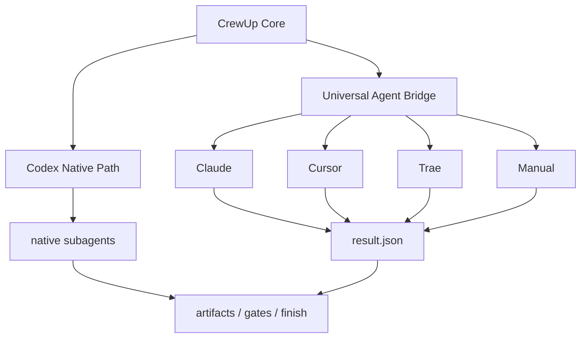
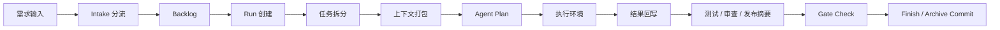

# CrewUp

中文 | [English](./README.en.md)


CrewUp 是一套面向真实工程仓库的可复用 AI 协作工作流协议。它把需求入口、上下文整理、角色委派、执行回写、验证、审查、发布准备与归档串成一个可追踪的闭环，帮助团队把 AI 开发流程做得更稳定、更统一。

CrewUp 不绑定具体技术栈，也不要求仓库必须长成某一种固定目录。它会先在目标仓库里读取真实证据，再通过 `crewup inspect` 和 `crewup init` 生成项目适配层，让通用工作流落到当前项目的实际结构上。

## 适用场景

- 需要把 AI 开发流程标准化的团队或个人
- 需要在 Codex、Claude、Cursor、Trae 等不同 agent 工具之间保持一致流程的项目
- 需要把需求、规划、实现、验证、审查和发布串成闭环的真实仓库

## 核心能力

- Codex 原生优先，其他 agent 通过统一桥接接入
- 先识别真实仓库，再生成项目适配层
- 需求冻结、上下文打包、token 账本、阶段门禁一体化
- docs-only 任务走轻闭环，减少无效测试和上下文开销
- 中英文双语文档与自测命令

## 工作方式



## 安装

```bash
npm install -D crewup-harness
```

先做环境检查：

```bash
npx crewup doctor
```

## 首次初始化

```bash
npx crewup install
npx crewup inspect --no-ai
npx crewup init
npx crewup check
```

`crewup init` 会先在目标项目中准备模板，再生成项目适配层和知识层基线。

## 选择执行环境

```bash
npx crewup init --agent codex
npx crewup init --agent claude
npx crewup init --agent cursor
npx crewup init --agent trae
npx crewup init --agent manual
```

不传 `--agent` 时会进入交互式选择。支持上下键，终端不支持 raw mode 时会自动退化为数字选择。CI 或脚本中可使用 `--yes` / `--no-interactive`。

## 日常使用

```bash
npx crewup run "现在实现：..."
npx crewup status
npx crewup next <run-id>
npx crewup report <run-id>
npx crewup gate-check <run-id>
npx crewup finish <run-id>
npm run test:flow
```



## 关键目录

```text
.harness/
  AGENTS.md                # 进入正式项目工作前的总入口
  orchestrator/            # 主 agent、路由和桥接协议
  config/                  # 工作流、模型、门禁、委派、上下文策略
  project/                 # 目标项目适配层，由 init 生成
  runs/                    # 每次 run 的输入、任务、产物和日志
  reports/                 # 运行态摘要
  knowledge/               # 可选的知识层
```

## 典型用法

Codex 路径：

```bash
npx crewup init --agent codex
npx crewup run "现在实现登录功能"
```

Claude / Cursor / Trae 路径：

```bash
npx crewup init --agent claude
npx crewup run "现在实现登录功能"
npx crewup agent-plan <run-id>
```

## 执行模式

| 模式 | 适用对象 | 说明 |
| --- | --- | --- |
| `native` | Codex | 优先使用 Codex 当前环境中的原生子 agent 能力 |
| `bridge` | Claude / Cursor / Trae | 生成 handoff 和 result 写回协议，让外部工具接入同一闭环 |
| `manual` | 人工或脚本流程 | 保留任务、上下文、门禁和报告，由用户或脚本补充结果 |

Claude、Cursor、Trae 的支持重点是“同一工作流协议”和“稳定结果回写”，不是强行假设所有工具都有完全相同的原生多 agent API。

## 常用命令

| 命令 | 作用 |
| --- | --- |
| `npx crewup doctor` | 检查运行环境和前置条件 |
| `npx crewup install` | 在目标项目中安装 CrewUp 模板 |
| `npx crewup inspect --no-ai` | 基于文件系统静态识别项目结构 |
| `npx crewup inspect --ai` | 在可用模型环境下增强项目识别 |
| `npx crewup init` | 生成项目适配层 |
| `npx crewup check` | 校验核心配置和必需文件 |
| `npx crewup run "..."` | 创建并准备一次需求 run |
| `npx crewup agent-plan <run-id>` | 生成 native plan 或 bridge handoff |
| `npx crewup status` | 查看当前 run、预算和上下文状态 |
| `npx crewup report <run-id>` | 生成结构化报告 |
| `npx crewup gate-check <run-id>` | 执行闭环门禁检查 |
| `npx crewup finish <run-id>` | 完成 run 并按策略归档 |

## 更多文档

| 文档 | 内容 |
| --- | --- |
| [工作流](./docs/harness-workflow.md) | 命令流程和 run 生命周期 |
| [Universal Agent Bridge](./docs/universal-agent-bridge.md) | 外部 agent 交接和结果写回协议 |
| [Agent 选择](./docs/harness-agent-selection.md) | 初始化时的 agent 选择和适配层生成 |
| [Agent 能力矩阵](./docs/harness-agent-capabilities.md) | 支持等级、能力边界和声明规则 |
| [核心边界](./docs/harness-core-boundary.md) | 可复用核心与项目适配层边界 |
| [扩展指南](./docs/harness-extension-guide.md) | skills、policies、rules、templates 扩展方式 |

## 说明

- `spec-freeze` 会把需求压缩成短摘要，减少后续重复长上下文读取。
- `context-pack` 会根据任务只收集必要文件，尽量压低 token 消耗。
- `native-plan` 会生成原生子 agent 计划或 bridge handoff。
- 文档类任务会走更轻的闭环，不再默认拉完整测试链。
- `status` 和 `report` 会显示 context budget 与 token ledger。
- `npm run test:flow` 会在临时项目里跑完整安装、初始化、文档闭环和产物检查。

## 边界

CrewUp 不替代你的构建系统、测试框架、CI/CD、业务架构或团队规范。它提供的是 AI 协作和交付闭环协议；真实项目仍应保留自己的 README、测试命令、发布流程和代码规范，CrewUp 会在初始化和运行过程中读取并引用这些信息。
