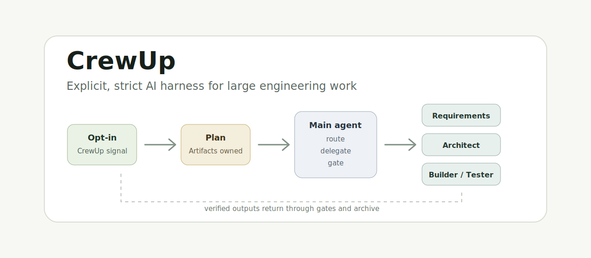

<p align="center">
  
</p>

<p align="center">
  <a href="https://www.npmjs.com/package/crewup-harness"></a>
  <a href="./LICENSE"></a>
  <a href="./docs/harness-workflow.md"></a>
  <a href="./docs/runbook.md"></a>
</p>

<h3 align="center">面向大型项目的 AI 工程工作流 Harness</h3>

<p align="center">
  <a href="./README.en.md">English</a>
  ·
  <a href="./docs/getting-started.md">快速开始</a>
  ·
  <a href="./docs/harness-workflow.md">工作流</a>
  ·
  <a href="./docs/runbook.md">Runbook</a>
  ·
  <a href="./docs/test-matrix.md">测试矩阵</a>
</p>

---

CrewUp 是一套可复用的 AI workflow harness。它不是新的模型，也不是一个 prompt 包，而是一套把需求澄清、架构设计、开发实现、测试、审查、发布和归档串起来的严格工程流程。

它解决的是 vibe coding 里最容易失控的部分：主 agent 职责膨胀、需求还没确认就写代码、多个子 agent 并行乱跑、测试反馈被主 agent 直接修、上下文越来越乱、一次需求到底完成还是卡住说不清。

CrewUp 的原则很明确：

- 主 agent 只负责创建 run、调用 `next-agent`、调度子 agent、登记结果、跑 gate/report/archive，并向用户汇报路径和状态。
- 正式产物由对应子 agent 生成：需求、架构、实现、测试报告、评审报告和发布摘要都有明确 owner。
- 每次正式需求都是一个 run，有状态、有证据、有报告、有归档结果。
- 安装 CrewUp 不代表接管所有 AI 对话；只有你明确说“使用 CrewUp / 按 harness 流程 / 继续某个 CrewUp run”时才进入严格流程。

## 为什么需要 CrewUp

很多 AI 编程问题不是模型不会写代码，而是流程没有边界：

- 需求不清楚就开始实现
- 架构没有收口，frontend/backend/database 等 agent 同时乱跑
- tester/reviewer 反馈后，主 agent 直接改业务文件
- 聊天窗口塞满日志、推理、产物和返工记录
- 一个需求到底是完成、取消、失败、部分完成还是阻塞，缺少统一状态
- 用户项目里的 `.harness` 被业务 run 顺手修坏

CrewUp 把这些风险变成可检查的工程约束：`run`、`owner artifact`、`next-agent`、`native-state`、`audit`、`gate-check`、`sealed core`、`report` 和 `archive`。

## 工作流一览

默认正式流程：

```text
requirements-plan
  -> requirements
  -> architect
  -> implementation agents assigned by implementation-plan.md
  -> tester
  -> reviewer
  -> release
```

关键规则：

- 初始 `next-agent` 只应该允许 `requirements-plan`。
- `requirements` 必须等 `requirements-plan` 完成并登记结果。
- `architect` 必须等正式需求完成。
- 实现类 agent 只是候选，只有 `implementation-plan.md` 明确分配后才启动。
- tester/reviewer 的阻塞反馈必须回派给对应 owner agent。
- 主 agent 不粘贴长结果，不代写 owner artifact，不代修业务代码。

## 安装

```bash
npm install -D crewup-harness
npx crewup install
npx crewup init --agent codex --yes
npx crewup check
```

已有项目建议先无 AI 扫描：

```bash
npx crewup inspect --no-ai
npx crewup init --agent codex --yes
```

升级已安装项目：

```bash
npx crewup install --force
```

`--force` 会更新 `.harness` 可复用核心，同时保留：

- `.harness/runs/`
- `.harness/knowledge/`
- `.harness/project/`
- `.harness/reports/`
- `.harness/dashboard/`

只有在你明确想清空旧 `.harness/` 时才使用：

```bash
npx crewup install --reset
```

## API Key 和子 Agent

CrewUp 是工作流 harness，不提供模型额度、API key 或内置云端 runner。

- `codex` native 模式依赖当前 Codex Desktop / CLI 的登录状态和 native subagent 能力。
- SDK/API 路径和 `inspect --ai` 需要 `OPENAI_API_KEY`。
- `claude`、`cursor`、`trae` 当前通过 Universal Agent Bridge 接入，使用各自工具的登录状态或 API key。
- `manual` 不需要 AI API key，由人或外部工具执行 handoff 并写回结果。

PowerShell：

```powershell
$env:OPENAI_API_KEY="sk-..."
```

macOS / Linux：

```bash
export OPENAI_API_KEY="sk-..."
```

## 第一次使用

CLI：

```bash
npx crewup run "使用 CrewUp 做一个最小 counter web app，跑完整 workflow。验收标准：页面显示 counter，初始值为 0；可以 +1、-1、reset；刷新后数值保留；build/test 通过。范围：只做一个很小的前端实现。"
```

聊天窗口：

```text
使用 CrewUp 做一个最小 counter web app，跑完整 workflow。验收标准：页面显示 counter，初始值为 0；可以 +1、-1、reset；刷新后数值保留；build/test 通过。范围：只做一个很小的前端实现。
```

如果是在聊天里提出需求，主 agent 应该自己运行 `npx crewup run "<需求>"`，拿到 runId 后继续 `npx crewup next-agent <run-id>`。用户不需要为了拿 runId 手动跑命令。

## 常用命令

| 命令 | 作用 |
| --- | --- |
| `npx crewup doctor` | 检查环境、可选集成、sealed core 和编码提示 |
| `npx crewup doctor --encoding-help` | 查看 Windows/macOS/Linux UTF-8 终端排查说明 |
| `npx crewup install` | 安装 CrewUp harness 模板 |
| `npx crewup install --force` | 安全升级 harness core，保留运行态数据 |
| `npx crewup install --reset` | 清空旧 `.harness/` 后重装 |
| `npx crewup inspect --no-ai` | 无 AI 扫描项目结构 |
| `npx crewup init --agent codex --yes` | 生成项目适配层 |
| `npx crewup check` | 校验配置、脚本、模板、文档和 sealed core |
| `npx crewup run "..."` | 创建正式 run |
| `npx crewup run --dry-run "..."` | 预览 run 命名、profile 和 agent 路由 |
| `npx crewup status` / `npx crewup runs` | 列出所有 run，查找 runId |
| `npx crewup status <run-id>` | 查看某个 run 的状态卡 |
| `npx crewup next-agent <run-id>` | 查看当前真正可启动的子 agent |
| `npx crewup clarify <run-id> --interactive` | 在终端中回答需求澄清问题 |
| `npx crewup native-state <run-id> diagnose` | 诊断子 agent handle、result 和状态差异 |
| `npx crewup audit <run-id>` | 审计调度顺序、owner 边界、上下文压力和返工 |
| `npx crewup gate-check <run-id>` | 检查 gate、产物归属和越权风险 |
| `npx crewup report <run-id>` | 生成结构化交付报告 |
| `npx crewup finish <run-id>` | 成功完成并按策略归档 run |
| `npx crewup archive <run-id> --outcome=blocked --reason="..."` | 以非成功结果归档并保留证据 |
| `npx crewup continue <run-id> "..."` | 基于历史 run 创建延续 run |

## Run 是核心工作单元

每次正式需求都会创建：

```text
.harness/runs/<run-id>/
```

常见文件：

| 文件 | 作用 |
| --- | --- |
| `RUN_STATUS.md` | 当前状态、阶段、owner、下一步、阻塞和进度 |
| `RUN_SUMMARY.md` | 归档摘要，可供后续 run 继续 |
| `artifacts/requirement-plan.md` | 需求澄清卡和需求扩展草案 |
| `artifacts/requirement.md` | 正式需求 |
| `artifacts/architecture.md` | 架构设计 |
| `artifacts/implementation-plan.md` | 实现分配和阶段计划 |
| `logs/run-report.md` | 当前 run 的交付报告 |

CrewUp 支持这些结局：

- `success`
- `partial`
- `blocked`
- `canceled`
- `failed`

归档不是“成功”的同义词。归档表示这次 run 的现场、证据和下一步已经整理清楚。

## 稳定性保障

CrewUp 通过几层机制保证流程稳定：

- `next-agent` 是唯一调度权威，防止 requirements/architect/implementation 提前并行。
- `native-state` 要求真实 handle 和 result 文件，防止主 agent 伪造子 agent 完成。
- `artifact provenance` 检查 owner artifact 是否由正确 agent 产出。
- `sealed core` 检查用户项目里的 `.harness` 核心是否被业务 run 修改。
- `gate-check` 阻止主 agent 越权写业务代码或跳过阶段产物。
- `archive-commit` 在没有初始 git commit 的新项目里会写审计并跳过提交，不会把成功 run 卡死。
- `native-state diagnose` 会提示“结果文件已存在但未登记”或“子 agent 运行过久未捕获结果”，减少主窗口等待。

## 本地验证

```bash
npm run harness:check
npm test
npm run test:install-flow
npm run harness:test-flow
npm run release:preflight
```

`release:preflight` 会运行 harness 校验、示例测试、临时项目 pack-install flow 测试和 `npm pack --dry-run`。

## 文档

| 文档 | 内容 |
| --- | --- |
| [快速开始](./docs/getting-started.md) | 安装、API key、第一次 run 和排查 |
| [工作流](./docs/harness-workflow.md) | 阶段、owner artifact、调度和 gate |
| [Runbook](./docs/runbook.md) | 怎么判断正常、完成、卡住、取消和继续 |
| [Troubleshooting](./docs/troubleshooting.md) | 终端编码、乱码判断和跨平台修复 |
| [本地测试](./docs/local-testing.md) | 使用 `npm pack` 和临时项目测试 CrewUp |
| [测试矩阵](./docs/test-matrix.md) | 不同改动应该跑哪些验证命令 |
| [核心边界](./docs/harness-core-boundary.md) | `.harness` 核心、项目适配层和运行态边界 |
| [Agent 能力矩阵](./docs/harness-agent-capabilities.md) | Codex/Claude/Cursor/Trae/Manual 支持边界 |
| [Agent 选择](./docs/harness-agent-selection.md) | `init` 选择项和适配层策略 |
| [Universal Agent Bridge](./docs/universal-agent-bridge.md) | 外部 agent handoff 和 result JSON 契约 |
| [脚本地图](./docs/harness-script-map.md) | 公开命令、核心流水线和维护脚本边界 |

## 适合谁

CrewUp 更适合长期迭代的大型项目、团队项目、复杂重构、全栈系统和需要严格 AI 开发流程的代码库。

如果只是一次性小修、小问答、临时脚本或非常小的个人实验，可以不启用 CrewUp。CrewUp 的价值在于把 AI 开发从“聊天里的临场发挥”变成可追踪、可审计、可继续、可归档的工程流程。
